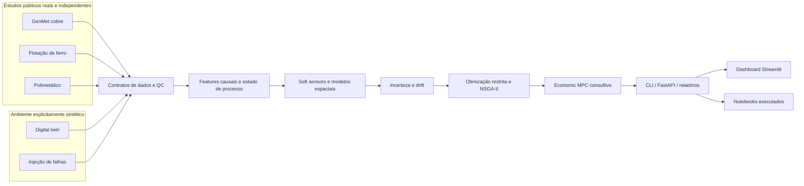

# ⚙️ Mineral Process Intelligence

### Geometalurgia · Cominuição · Flotação · Séries Temporais Industriais · Soft Sensors · Digital Twin · Otimização · Economic MPC

[](https://www.python.org/)
[](https://github.com/Yuri-Fernando/Mineral_-Process-Inteligence/actions/workflows/ci.yml)
[](LICENSE)
[](CHANGELOG.md)
[](docs/safety_boundaries.md)

Plataforma local-first de pesquisa aplicada para inteligência de processos minerais. O projeto combina
modelos de engenharia, dados públicos reais, aprendizado de máquina, simulação determinística,
monitoramento de drift, otimização multiobjetivo e controle preditivo em uma única base reproduzível.

O repositório contém três estudos de caso reais e independentes — cobre GeoMet, flotação de minério
de ferro e moagem/classificação polimetálica — além de um ambiente sintético explicitamente
identificado. Os estudos não são concatenados nem apresentados como se pertencessem à mesma usina.

> **Limite essencial:** este projeto não representa implantação em uma mina ou concentrador em
> produção. Não há conexão de escrita com PLC, DCS, historiador ou sistema de otimização industrial.
> Toda recomendação é consultiva, limitada por regras de qualidade, incerteza e restrições.

## Status

| Área | Estado | Evidência |
|---|---|---|
| Núcleo Python e CLI | Implementado | pacote `mineral_process`, comandos reproduzíveis e 21 testes |
| Dados públicos | Baixados localmente | 5 arquivos, checksums SHA-256 e proveniência; dados brutos fora do Git |
| Estudos reais | Implementados | holdout espacial GeoMet e holdouts ordenados dos demais casos |
| Digital twin e falhas | Implementados | simulação determinística, distúrbios e 8 modos de falha de sensor |
| Otimização e controle | Implementados | recomendação restrita, GP-EI, NSGA-II e Economic MPC |
| API e dashboard | Implementados | FastAPI consultiva e Streamlit com 5 abas / 5 gráficos |
| Notebooks | Executados e versionados | 4 notebooks, 29 células de código e 30 outputs persistidos |
| Qualidade local | Validada | `21 passed`, Ruff limpo e mypy limpo em 35 arquivos-fonte |
| Docker | Configuração validada | Compose analisado; runtime não validado por daemon indisponível |
| Operação industrial | Fora do escopo | exige calibração, HAZOP/MOC, cibersegurança e comissionamento |

## Descrição / Contexto

Processos minerais combinam fenômenos físicos, variáveis operacionais multivariadas, medições com
frequências diferentes e análises laboratoriais atrasadas. Otimizar recuperação sem respeitar teor,
qualidade de dados, limites dos atuadores ou validade do modelo pode produzir uma recomendação
numericamente atraente e operacionalmente inadequada.

Mineral Process Intelligence trata esse problema como um sistema completo:

1. dados são adquiridos com proveniência e separados por origem;
2. invariantes de engenharia verificam coerência física básica;
3. features temporais usam somente informação disponível no instante da previsão;
4. modelos retornam estimativa e incerteza;
5. drift e falhas de sensores degradam ou bloqueiam recomendações;
6. otimizadores trabalham dentro de limites explícitos;
7. API, dashboard e notebooks reutilizam o mesmo núcleo de produção;
8. resultados negativos são registrados, não ocultados.

## 🌱 Como nasceu

O projeto foi concebido como um laboratório reproduzível de engenharia de processos e ciência de
dados industriais. Sua origem técnica é a necessidade de demonstrar, de ponta a ponta, como
conhecimento metalúrgico, validação causal, simulação e otimização podem coexistir sem confundir
protótipos sintéticos com evidência de planta real.

A implementação prioriza software gratuito, execução em CPU, dados públicos e artefatos locais. O
código/CLI é a fonte de verdade; dashboard e notebooks são camadas de apresentação e aprendizado.

## 🎯 Objetivos

- representar balanço de massa e metal com verificações explícitas de conservação;
- modelar relações simplificadas de cominuição, classificação e cinética de flotação;
- preparar séries temporais industriais sem vazamento de futuro;
- estimar sílica com soft sensor e intervalo de predição;
- avaliar generalização espacial em geometalurgia;
- reproduzir falhas de instrumentação e medir drift de distribuição;
- comparar otimização de ponto único, Bayesian Optimization e NSGA-II;
- comparar controle fixo, baseado em regras e Economic MPC sob o mesmo distúrbio;
- expor contratos consultivos via CLI, API, dashboard e notebooks;
- registrar decisões, versões, limitações e evidências de validação.

## 🔬 Linha de pesquisa e desenvolvimento

O repositório explora quatro linhas complementares:

- **modelagem híbrida:** equações de domínio e modelos estatísticos convivem sob contratos comuns;
- **validação realista:** separações cronológicas e espaciais substituem embaralhamento ingênuo;
- **otimização segura:** objetivos econômicos são subordinados a limites e gates de qualidade;
- **MLOps local-first:** relatórios JSON/CSV/modelos são suficientes; MLflow é uma integração opcional.

## 🏗️ Arquitetura



### Princípios de projeto

- **Separação por caso:** compartilhar algoritmos não significa inventar uma planta unificada.
- **Causalidade temporal:** rolling, lag e agregações usam apenas passado e presente permitido.
- **Fail-closed:** ausência de sensor crítico, qualidade ruim, incerteza alta ou inviabilidade bloqueia ação.
- **Reprodutibilidade:** sementes, configurações, checksums e comandos são explícitos.
- **Rastreabilidade:** `PROJECT_LEDGER.md`, `CHANGELOG.md` e `VERSION` preservam histórico.
- **Apresentação fina:** UI e notebooks chamam módulos reais, sem duplicar fórmulas de negócio.

## 🧩 Módulos

| Módulo | Responsabilidade principal |
|---|---|
| `domain.mass_balance` | balanço de massa/metal e resíduos de conservação |
| `domain.comminution` | energia específica baseada em Bond e relações de granulometria |
| `domain.classification` | curva de partição/classificação de hidrociclone |
| `domain.flotation` | cinética simplificada de recuperação |
| `data.datasets` | download independente, tolerância a falhas e checksums SHA-256 |
| `data.loaders` | leitura e normalização específica por fonte |
| `quality.data_quality` | flags de qualidade para tags industriais |
| `features.temporal` | lags, rolling e consolidação causal de timestamps |
| `models.soft_sensor` | treinamento, intervalos e inferência do soft sensor |
| `geomet.spatial` | holdout por bloco espacial e ensemble de incerteza |
| `simulation.digital_twin` | planta mineral sintética e determinística |
| `simulation.sensor_faults` | falhas reproduzíveis de instrumentação |
| `monitoring.drift` | PSI, KS e distância de Wasserstein |
| `optimization.recommend` | recomendação restrita com status de segurança |
| `optimization.bayesian` | Processo Gaussiano e Expected Improvement |
| `optimization.nsga2` | implementação local de NSGA-II |
| `optimization.advanced` | orquestração dos otimizadores avançados |
| `control.mpc` | Economic MPC consultivo |
| `control.benchmark` | comparação justa sob distúrbio comum |
| `monitoring.tracking` | JSON local e espelhamento opcional no MLflow |
| `api.main` | contratos HTTP consultivos |

## ⚙️ Funcionamento de ponta a ponta

```text
acquire -> checksum -> validate -> engineer causal features -> fit/evaluate
        -> quantify uncertainty/drift -> optimize under constraints
        -> recommend or reject -> report -> dashboard/notebook
```

### 1. Aquisição e proveniência

`mpi download-data` trata cada fonte isoladamente. Um erro em uma origem não apaga downloads já
concluídos. Os arquivos permanecem em `data/raw/`, são ignorados pelo Git e recebem hash SHA-256 no
manifesto local.

### 2. Engenharia e qualidade

Os componentes físicos validam unidades e conservação. Para séries temporais, o pipeline ordena
timestamps, consolida amostras e constrói atributos atrasados/rolling sem observar o futuro. Tags
faltantes, constantes, fora de faixa ou suspeitas alimentam o contrato de qualidade.

### 3. Modelagem

O soft sensor clássico estima sílica do concentrado sem usar `% Iron Concentrate` ou
`% Silica Concentrate` como entrada online no mesmo instante, pois são variáveis laboratoriais do
mesmo ensaio. GeoMet usa blocos espaciais, enquanto os estudos temporais preservam a ordem.

### 4. Diagnóstico e otimização

Drift é medido por estatísticas complementares. A otimização só produz recomendação quando dados,
incerteza e restrições passam pelos gates. O projeto inclui busca diferencial, Processo Gaussiano
com Expected Improvement e fronteira multiobjetivo evoluída com NSGA-II.

### 5. Controle consultivo

O Economic MPC projeta uma ação limitada pelos bounds configurados. O benchmark reaplica o mesmo
distúrbio seeded aos controladores fixo, por regras e MPC, evitando comparações com cenários distintos.
Nenhuma resposta é enviada para equipamento real.

## 📦 Dados públicos

| Caso | Fonte | Uso neste projeto | Estratégia de validação | Política Git |
|---|---|---|---|---|
| Copper GeoMet | [Zenodo 7051975](https://zenodo.org/records/7051975) | targets `M`, `A`, `LCT` e incerteza | holdout por bloco espacial | bruto ignorado |
| Iron flotation | [Kaggle](https://www.kaggle.com/datasets/edumagalhaes/quality-prediction-in-a-mining-process) | soft sensor de sílica e features causais | holdout cronológico final | bruto ignorado |
| Polymetallic grinding | [Zenodo 22773521](https://zenodo.org/records/22773521) | recuperação Ag/Cu/Pb/Zn e Pareto observado | holdout ordenado final | bruto ignorado |
| Synthetic plant | código deste repositório | falhas, DOE, otimização e MPC | repetição determinística por seed | gerado localmente |

Download:

```powershell
mpi download-data
```

O Kaggle pode exigir credenciais gratuitas configuradas pelo próprio usuário. O projeto não inclui,
não redistribui e não faz commit de datasets de terceiros.

## 📊 Resultados reproduzidos localmente

### Estudo sintético principal

| Métrica do soft sensor | Resultado |
|---|---:|
| MAE | 0.0804 |
| RMSE | 0.1030 |
| R² | 0.7904 |

O distúrbio seeded gerou drift detectável. A recomendação principal retornou `REVIEW` porque o teor
predito ficou abaixo da especificação — comportamento esperado do gate, não falha a ser ocultada.

### GeoMet — holdout espacial

| Target upstream | Treino / teste | R² espacial |
|---|---:|---:|
| `M` | 56 / 4 | 0.5538 |
| `A` | 56 / 4 | 0.2805 |
| `LCT` | 45 / 7 | 0.4497 |

Os nomes originais dos targets são preservados para não inventar semântica não garantida pela fonte.
A amostra de teste é pequena; os números demonstram o pipeline, não uma certificação de desempenho.

### Flotação de ferro — holdout cronológico

| Baseline | R² final |
|---|---:|
| simples, 120 mil linhas brutas | -0.5989 |
| causal, 667 timestamps e 252 atributos passados | -0.6141 |

O modelo causal não superou o baseline simples. O resultado negativo é mantido como evidência de
mudança de regime, insuficiência dos atributos e dificuldade real do problema. Não foi aplicado
embaralhamento para produzir uma métrica artificialmente melhor.

### Polimetálico — holdout ordenado

Os quatro baselines de recuperação apresentaram R² negativo no segmento final. As nove variáveis de
moagem/classificação, isoladamente, não generalizaram para a parte mais recente da fonte. A fronteira
observada contém 41 linhas e é **descritiva**, sem alegação causal.

### Otimização avançada sintética

| Método | Evidência |
|---|---|
| GP + Expected Improvement | 20 avaliações; recuperação prevista 0.8864; teor 0.1838; `SAFE` no simulador |
| NSGA-II | 36 soluções não dominadas evoluídas |

`SAFE` significa somente que o candidato respeitou as restrições configuradas no simulador.

### Benchmark de controle

| Controlador | Recuperação média | Leitura correta |
|---|---:|---|
| fixo | 0.9221 | referência no mesmo distúrbio |
| Economic MPC | 0.9356 | maior recuperação média, porém fora do teor especificado |

Todos os 45 intervalos do benchmark violaram a especificação de teor 0.18. Por isso, o MPC retorna
`REVIEW`; a melhora de recuperação não é apresentada como sucesso operacional.

## 🚀 Quickstart

### Requisitos

- Python 3.10+
- Git
- ambiente local com aproximadamente 1 GB livre se todos os dados forem baixados
- Docker é opcional

### Windows PowerShell

```powershell
py -3.10 -m venv .venv
.\.venv\Scripts\python.exe -m pip install --upgrade pip
.\.venv\Scripts\python.exe -m pip install -e ".[dev]"
.\.venv\Scripts\python.exe -m mineral_process.cli run-demo
```

### Linux / macOS

```bash
python3.10 -m venv .venv
source .venv/bin/activate
python -m pip install --upgrade pip
python -m pip install -e ".[dev]"
python -m mineral_process.cli run-demo
```

A instalação editável cria também o comando curto `mpi`.

## 🖥️ CLI — fonte de verdade

```powershell
mpi download-data
mpi run-demo --seed 42
mpi run-real-cases --seed 42
mpi benchmark-control --seed 42
mpi advanced-optimize --seed 42
```

| Comando | Saída principal |
|---|---|
| `download-data` | arquivos locais, falhas por fonte e manifesto de proveniência |
| `run-demo` | modelo, métricas, drift, recomendação e artefatos sintéticos |
| `run-real-cases` | relatórios GeoMet e polimetálico separados |
| `benchmark-control` | métricas e trajetórias dos três controladores |
| `advanced-optimize` | resumo GP-EI e conjunto Pareto NSGA-II |

## 🌐 API FastAPI

Inicialização:

```powershell
uvicorn mineral_process.api.main:app --reload
```

Documentação interativa: `http://127.0.0.1:8000/docs`

| Método | Endpoint | Função |
|---|---|---|
| GET | `/health` | status, versão e modo consultivo |
| GET | `/model/info` | identidade do twin e do controle |
| GET | `/simulation/state` | estado atual da planta sintética |
| POST | `/simulation/step` | avança uma etapa dentro dos bounds |
| POST | `/soft-sensor/predict` | predição de sílica e intervalo |
| POST | `/process/state` | valida sensores críticos e qualidade |
| POST | `/fault/inject` | injeta falha sintética reproduzível |
| POST | `/monitoring/drift` | calcula relatório de drift |
| POST | `/optimize` | recomenda ou bloqueia setpoints |
| POST | `/mpc/recommend` | ação MPC consultiva com safety status |

Exemplo:

```bash
curl -X POST http://127.0.0.1:8000/monitoring/drift \
  -H "Content-Type: application/json" \
  -d '{"reference":[1,2,3,4,5],"current":[2,3,4,5,6]}'
```

## 📈 Dashboard Streamlit

```powershell
streamlit run dashboards/app.py
```

O dashboard é uma camada somente de leitura sobre os relatórios gerados. Suas cinco abas cobrem:

1. visão geral e estado dos artefatos;
2. casos reais GeoMet e polimetálico;
3. otimização e conjunto Pareto;
4. comparação dos controladores;
5. proveniência e limites dos dados.

A validação local com `streamlit.testing.v1.AppTest` renderizou cinco abas, cinco gráficos Plotly e
zero exceções.

## 📓 Notebooks end-to-end

Os notebooks versionados já estão executados, com outputs persistidos e kernel Python 3.10 explícito.
Eles chamam o pacote de produção, evitando uma segunda implementação escondida em células.

| Notebook | Células / outputs | Conteúdo |
|---|---:|---|
| [`01-domain-digital-twin.ipynb`](output/jupyter-notebook/01-domain-digital-twin.ipynb) | 8 / 9 | invariantes físicos, twin e falhas |
| [`02-public-data-case-studies.ipynb`](output/jupyter-notebook/02-public-data-case-studies.ipynb) | 7 / 6 | dados públicos, soft sensor e validação temporal |
| [`03-optimization-mpc.ipynb`](output/jupyter-notebook/03-optimization-mpc.ipynb) | 8 / 9 | otimização, NSGA-II e benchmark MPC |
| [`04-real-geomet-polymetallic.ipynb`](output/jupyter-notebook/04-real-geomet-polymetallic.ipynb) | 6 / 6 | casos reais GeoMet e polimetálico |

Reexecução completa:

```powershell
py -3.10 -m ipykernel install --user --name mineral-process-py310
py -3.10 scripts\execute_notebooks.py
```

O primeiro comando registra o kernel no perfil local; o segundo falha imediatamente se uma célula
produzir exceção e só salva um notebook após a execução bem-sucedida.

## 🐳 Docker

```powershell
docker compose build
docker compose run --rm mpi
```

O arquivo Compose foi validado sintaticamente. A imagem não foi construída nesta rodada porque o
daemon Linux do Docker Desktop não estava disponível; isso é uma dependência externa ainda não
validada, não um resultado presumido.

## 🧪 Validação

```powershell
ruff check .
mypy src/mineral_process
pytest
py -3.10 scripts\execute_notebooks.py
```

Evidência local da versão `0.2.2`:

- pytest: **21 testes aprovados**;
- Ruff: **todos os checks aprovados**;
- mypy: **sucesso em 35 arquivos-fonte**;
- dashboard: **5 abas, 5 gráficos, zero exceções**;
- notebooks: **4 arquivos, 29 células executadas, 30 outputs, zero erro**;
- Docker Compose: **configuração válida; runtime não executado**;
- MLflow: **espelhamento não executado porque o extra opcional não está instalado**.

A suíte cobre conservação de massa/metal, invariantes científicos, causalidade temporal,
reprodutibilidade de falhas, limites do otimizador, safety gates, tracking e contratos da API.

## 📁 Estrutura do repositório

```text
Mineral Process Intelligence/
├── .github/workflows/ci.yml       # Ruff + mypy + pytest no GitHub Actions
├── configs/                       # bounds da planta e catálogo de datasets
├── dashboards/app.py              # apresentação Streamlit somente leitura
├── data/                           # raw/interim/processed; conteúdo pesado ignorado
├── docs/                           # arquitetura, dicionário, cards e segurança
├── models/                         # modelos locais ignorados
├── output/jupyter-notebook/        # quatro notebooks executados
├── reports/generated/              # relatórios reproduzíveis ignorados
├── scripts/                        # geração, população e execução dos notebooks
├── src/mineral_process/            # pacote e fonte de verdade
├── tests/                          # testes unitários, científicos e de integração
├── CHANGELOG.md                    # histórico SemVer
├── PROJECT_LEDGER.md               # registro mestre de decisões/evidências
├── VERSION                          # versão canônica
├── Dockerfile
├── docker-compose.yml
└── pyproject.toml
```

## 🔒 Segurança e uso responsável

A política de recomendação é fechada por padrão:

- sensor crítico ausente → `REJECT` / `NO_ACTION`;
- qualidade `BAD` ou `MISSING` → ação bloqueada;
- incerteza acima do limite → ação bloqueada;
- solução que viola teor ou bounds → `REVIEW` ou rejeição;
- status `SAFE` → válido somente no envelope do simulador.

Uma eventual aplicação real exigiria, no mínimo, reconciliação de dados, calibração por campanha,
revisão de perigos, gestão de mudanças, validação do controlador, cibersegurança OT, aceitação dos
operadores, operação paralela/sombra e comissionamento controlado.

## ⚠️ Limitações conhecidas

- não existe conexão com historiador, LIMS, PLC, DCS ou ativo de produção;
- o digital twin é compacto e não calibrado para uma planta identificável;
- datasets públicos não transferem automaticamente para outra operação;
- amostras espaciais de teste do GeoMet são pequenas;
- os baselines reais de ferro e polimetálico têm desempenho negativo no holdout final;
- a fronteira polimetálica observada é descritiva, não causal;
- a licença machine-readable de cada dataset deve ser confirmada na fonte antes de redistribuição;
- MLflow e Optuna são extras opcionais, não requisitos do fluxo principal;
- Docker precisa ser validado em ambiente com daemon ativo.

## 🗺️ Roadmap

### Modelagem

- calibrar modelos temporais por regime operacional;
- avaliar modelos sequenciais somente após consolidar baselines causais;
- introduzir reconciliação de dados com incerteza de medição;
- ampliar quantificação de incerteza e calibração de intervalos.

### Engenharia de processo

- conectar um simulador externo de processo em modo offline;
- enriquecer o twin com circuitos de moagem e flotação por estágio;
- modelar restrições de inventário, energia e água;
- incluir cenários de degradação de instrumentação combinada.

### Operação e MLOps

- validar imagem Docker em CI;
- publicar artefatos compactos de benchmark sem dados de terceiros;
- adicionar monitoramento de performance por janela/regime;
- integrar MLflow opcionalmente sem tornar o fluxo local dependente dele.

## 📚 Documentação

- [Arquitetura](docs/architecture.md)
- [Cards dos datasets](docs/dataset_cards.md)
- [Dicionário de dados](docs/data_dictionary.md)
- [Limites de segurança](docs/safety_boundaries.md)
- [Registro mestre e histórico](PROJECT_LEDGER.md)
- [Changelog](CHANGELOG.md)

## Versionamento e continuidade

O projeto usa [Semantic Versioning](https://semver.org/) e o formato
[Keep a Changelog](https://keepachangelog.com/). Toda alteração material deve:

1. atualizar `VERSION` e `project.version` em conjunto;
2. registrar mudanças em `CHANGELOG.md`;
3. acrescentar decisões e evidências ao `PROJECT_LEDGER.md`, sem apagar entradas anteriores;
4. executar testes, lint, tipos e notebooks proporcionalmente à mudança;
5. manter dados brutos, modelos, caches, segredos e relatórios gerados fora do Git.

Versão atual: **0.2.2**.

## Licença

O código deste repositório é distribuído sob a licença [MIT](LICENSE). Datasets de terceiros mantêm
seus próprios termos, licenças e requisitos de atribuição.

## Autor

**Yuri Fernando** — engenharia de software, ciência de dados e inteligência de processos.
